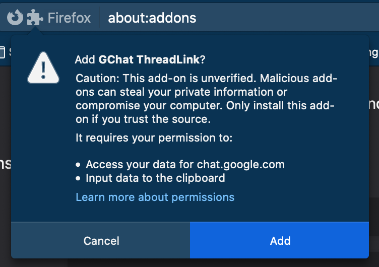

# May 20th 2020

So, I'm finishing up my PR for the issue
https://github.com/sriv/gchat-threadlink/issues/1

PR: https://github.com/sriv/gchat-threadlink/pull/2

I tested the code - that is, the permissions part, by checking some docs.

https://extensionworkshop.com/documentation/develop/test-permission-requests/#observe-or-verify-install-time-permission-requests

I first tried to install without a `xpi` or `zip` file, firefox just disabled the
open button in the explorer for the directory or the `manifest.json`. I didn't
check the docs properly 🤦‍♂ Then I made a `zip` myself using this

```bash
$ zip -r gchat-threadlink.zip gchat-threadlink/
```

Funnily it even zipped my `.git` directory, but I didn't care and this time
I was allowed to choose the zip, but later it said the file was corrupted.

Later I found out that I wasn't supposed to do it like that. And found this doc

https://extensionworkshop.com/documentation/develop/getting-started-with-web-ext/#packaging-your-extension

And then I got `web-ext`, which I didn't have for some reason. I think it's
because I upgraded my `node` version once and got rid of the old one. And then
I ran the command to create the zip

```bash
$ npm i -g web-ext
$ # inside addon directory
$ web-ext build
Building web extension from /Users/karuppiahn/oss/github.com/sriv/gchat-threadlink
Your web extension is ready: /Users/karuppiahn/oss/github.com/sriv/gchat-threadlink/web-ext-artifacts/gchat_threadlink-1.0.zip
```

And to rebuild, that doesn't work

```bash
$ web-ext build
Building web extension from /Users/karuppiahn/oss/github.com/sriv/gchat-threadlink

s: Extension exists at the destination path: /Users/karuppiahn/oss/github.com/sriv/gchat-threadlink/web-ext-artifacts/gchat_threadlink-1.0.zip
Use --overwrite-dest to enable overwriting.
```

So I had to use an extra option for it, called `--overwrite-dest` as the error
says. So I did it then

```bash
$ web-ext build --overwrite-dest
Building web extension from /Users/karuppiahn/oss/github.com/sriv/gchat-threadlink
Destination exists, overwriting: /Users/karuppiahn/oss/github.com/sriv/gchat-threadlink/web-ext-artifacts/gchat_threadlink-1.0.zip
Your web extension is ready: /Users/karuppiahn/oss/github.com/sriv/gchat-threadlink/web-ext-artifacts/gchat_threadlink-1.0.zip
```

And I changed the `xpinstall.signatures.required` settings in `about:config`
in Firefox to `false` and then in the addons page `about:addons`, clicked the
small gear and chose the option to `Install Add-on From File...` and chose the
zip file and it asked for permissions then. Below is a screenshot



Now, I gotta work on some comments. So, with the existing code, I had actually
used closures and created many functions for the `onclick` event handling. A
better thing could have been, use the `event` object of the click and getting
the data from the element that has been clicked and then using that data.
I was using a `span` tag, that's fine, I could have added some extra attribute,
like how I have seen people add some `data` attribute or something. I gotta
see how to use the `event` object to get the clicked element's attribute values.

Also, I have been asked to just change the `a` tag's behavior instead of adding
another element. I think it makes sense. I just think about one thing - will
it still be possible to right click and copy the link as before? I don't know,
I'll have to check that. So, the idea now is - people click the `a` tag and it
doesn't follow the link which is what usually the anchor tag does, and instead
the link is copied to clipboard. And I also got some more comments

So, what I gotta do is -
* Get rid of the `span` tag
* Add the feature to `a` tag and prevent the default behavior of `a` tag
* Try to use the `event` object of the click event instead of creating tons
of functions for multiple threads / links
* Don't print to console for success. Print only for failure

Okay, so I finished the first two. In between I had a small hiccup where I
thought the extension's behavior was not working, the link being wrong. I don't
know how it went wrong. Later found out it works okay and that google hasn't
changed anything in their behavior.

Oh. Wait. I found out! I think I'm going to solve that issue separately by
putting an issue for it first and discuss thoughts :)

The issue is this - after going to a thread using the thread specific link,
the addon doesn't work, as it keeps appending the thread's id to the document
URL, which is different in different situations.

Also, one more issue I noticed is - the addon doesn't put links for all threads.
The reason is because it loads once when the page loads and that's it. But
google is dynamically loading threads, so when you scroll up or down and threads
are dynamically shown, the addon is already done it's work and will not be
adding links to these new dynamically shown threads. Gotta raise an issue for
that too! :)

Now, back to business. I gotta remove the multiple functions first. Actually,
I removed the console log for success. I don't know if I can get rid of the
`.then()`. For now I'm leaving it alone. Back to multiple functions!

So, for `event` objects, this is what I found - 

https://www.w3schools.com/jsref/event_onclick.asp
https://www.w3schools.com/jsref/obj_mouseevent.asp
https://www.w3schools.com/jsref/event_relatedtarget.asp
https://www.w3schools.com/jsref/tryit.asp?filename=try_dom_event_relatedtarget

So, I tried the example with `onclick` and it didn't work out. It said
`event.relatedTarget` is `null`

I did see this one other example which looked cool! :) Something like this

```html
<p onclick="myFunction(this, 'red')">Click me to change my text color.</p>
```

But for this I have to write the function definition inside the html. Hmm.

Awesome! So I tried this -

```html
<!DOCTYPE html>
<html>
<body>

<a href="blah" onclick="return myFunction(this, 'red')">Click me to change my text color.</a>
<a href="bloo" onclick="return myFunction(this, 'red')">Click me to change my text color.</a>


<script>
function myFunction(elmnt,clr) {
  elmnt.style.color = clr;
  console.log(elmnt.href)
  return false;
}
</script>

</body>
</html>
```

And it worked well! Initially I didn't know / understand how the html `onclick`
attribute was working. So apparently I can put both Js code in the string, or
assign it a function value which will get called later. In this case, I have
to do it in html and use the `this` in it. That way I get the element that has
been clicked and it just works! :)

Okay. So. I'm not able to set the string for `a` tag like this

```js
a.onclick = 'return copyToClipboard(this);'
```

It just doesn't even show up in the webpage. I can see other attributes, but
not this one. Hmm.

I'm checking this question 

https://stackoverflow.com/questions/3007336/how-do-you-assign-a-javascript-onclick-attribute-dynamically#3007402

So, I noticed a good point about using `addEventListener` instead of assigning
to `onclick`. I think I could do that. Hmm.

Damn. I actually remember learning about these.

Found this

https://www.w3schools.com/jsref/met_document_addeventlistener.asp
https://www.w3schools.com/jsref/tryit.asp?filename=tryjsref_document_addeventlistener

After little bit of craziness, I made things work

```html
<!DOCTYPE html>
<html>
<body>

<a href="blah" id="demo">something</a><br>
<a href="bloo" id="demo1">something else</a>


<script>
let a = document.getElementById("demo")
let a1 = document.getElementById("demo1")
a.addEventListener("click", function(event){
  event.preventDefault();
  console.log(event.target.href)
  return false
});
a1.addEventListener("click", function(event){
  event.preventDefault();
  console.log(event.target.href)
  return false
});

</script>

</body>
</html>
```

So, that's what I'm going to do! Yay! :) Cleaner way of doing things! :)

Some links that helped to confirm my doubts for preventing default :)

https://stackoverflow.com/questions/265478/preventdefault-on-an-a-tag#265499
https://www.w3schools.com/jsref/event_preventdefault.asp

One more thing to notice is, the `click` event doesn't fire up for right
clicking. I wanted to know this - as I wanted to check if people can still
right click and copy link like before, more like trying to understand is the
new feature working without breaking existing behaviour :) So, when you right
click, it's just a right click, and it doesn't copy to your clipboard. You can
click the link for that, or right click and choose copy link too! :)

Awesome! Everything works and I manually tested it! :)
