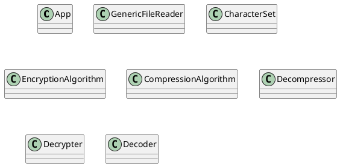
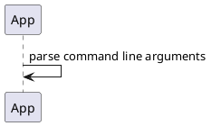
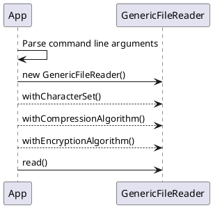
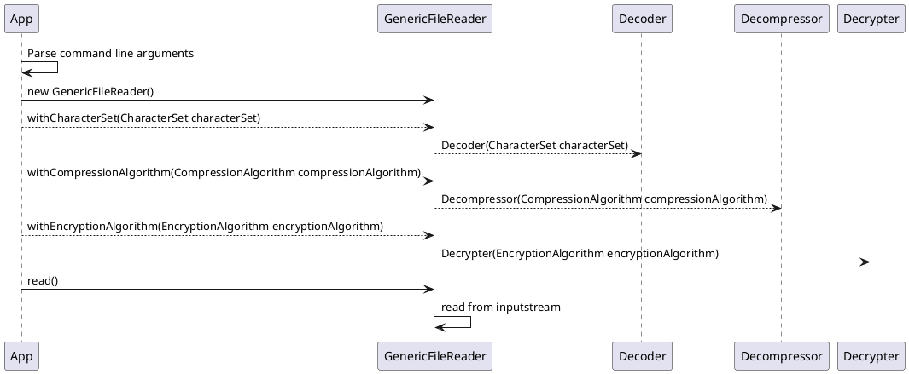

# October 4th 2020

Today I wanted to understand a bit about Scratch https://scratch.mit.edu/ .
I used it last week to create something. I was wondering yesterday how I didn't
check if it's open source. I started digging a bit about it.

I found lots of links at the end of it's web page :P

There's Scratch for Parents - https://scratch.mit.edu/parents/

There's Scratch for Educators - https://scratch.mit.edu/educators ! And there
are Scratch accounts for teachers specifically ! 

https://scratch.mit.edu/educators#teacher-accounts

And then there's Scratch for Developers

https://scratch.mit.edu/developers

And that's where a lot of things about code is mentioned! :D :)

https://github.com/LLK/scratch-blocks
https://developers.google.com/blockly/

https://github.com/LLK/scratch-www

Scratch Jr
http://www.scratchjr.org/
http://www.scratchjr.org/about/info

Scratch GUI github project
https://github.com/LLK/scratch-gui
https://llk.github.io/scratch-gui/develop/

The whole org in GitHub with tons of projects
https://github.com/LLK

LLK stands for Life Long Kindergarten
https://www.media.mit.edu/groups/lifelong-kindergarten/overview
https://www.media.mit.edu/groups/lifelong-kindergarten/projects/
https://www.media.mit.edu/groups/lifelong-kindergarten/updates/

There's ScratchEd, an archive
http://scratched.gse.harvard.edu/


Scratch Day
https://day.scratch.mit.edu/

Scratch Month!
https://sip.scratch.mit.edu/scratchmonth/

Scratch Conference
https://scratch.mit.edu/conference/2020

There are so many apps for Scratch and Scratch Jr

I just got this one
https://play.google.com/store/apps/details?id=org.scratchjr.android

And the Mac Desktop App here
https://scratch.mit.edu/download

At first Scratch was under MIT but now has spun out into it's own foundation
https://www.scratchfoundation.org/
https://www.scratchfoundation.org/our-story

---

Found this nice paint tool
https://kidmons.com/game/paint-online/

My nephew used it to draw stuff. He loved it! :) I think there must be tons of
such paint tools. It would be interesting to create on with HTML 5 Canvas ;)

https://duckduckgo.com/?t=ffab&q=web+paint+for+kids&ia=web
https://www.doublemesh.com/online-paint-tool/

----

I started checking out a problem today

```markdown

Designing generic File based reader which supports reading data and handles encoding, decryption & decompression based on user configuration. Take file properties as input

1. CharSet :
Charset with which the file data (binary) is encoded with. For example
ISO-8859-1 is used to convert ISO Latin Alphabet string to binary for writing into file.
In case if this property is not specified then consider the bytes (Update: File is encoded with UTF-8) are encoded with UTF-8.

2. Encryption :
Encryption algorithm used for encrypting the data before writing to file. For
example AES. If not specified, then there is no encryption and the data persisted
as plain text.

3. Compression:
Compression logic used to compress the data before writing to file. Possible
values are gzip, bzip, bz etc. In case not specified, data is uncompressed.
Design classes with respective methods to read files and perform the operation specified and return the plain text to the caller.
We expect the candidate to submit a class diagram along with sequence diagram and small writeup about their design approach stating the reason why it has been designed so.
Also cover unit tests as well.
 
Requirements
- Looking to have the modules (one for compressor, one for encryptors) loaded dynamically based on the user's input. something like this:

Usage 1
>> readCSVRecord file=foo.zzz compression=gzip encryption=AES128

Here compression and encryption modules are loaded since user specify both the options. It means, data is decompressed first, decrypted and parsed as CSV record

Usage 2
>> readCSVRecord file=foo.zzz compression=gzip
Here compression module is loaded since user specify compression only. It means, data is decompressed and parsed as CSV record

Usage 3
>> readCSVRecord file=foo.zzz encryption=AES128
Here encryption module is loaded since user specify encryption only. It means, data is decrypted and parsed as CSV record

Usage 4
>> readCSVRecord file=foo.zzz
No option is specified. It means, data is read and parsed as CSV record

Goal is to load and add these module dynamically (For example ,we can have decoding module for the characterset in future)
```

```
package io.github.karuppiah7890.genericfilereader

class App {
    public static void main(String args[])
}

class GenericFileReader {
    private final String filePath;
    private static InputStream inputStream;

    GenericFileReader(String filePath)

    GenericFileReader withCharacterSet(CharacterSet characterSet)

    GenericFileReader withEncryptionAlgorithm(EncryptionAlgorithm encryptionAlgorithm)

    GenericFileReader withCompressionAlgorithm(CompressionAlgorithm compressionAlgorithm)

    int read(byte[] data)
}

enum CharacterSet {
    UTF8
}

enum EncryptionAlgorithm {
    AES
}

enum CompressionAlgorithm {
    GZIP,
    BZIP
}

class Decompressor {
    Decompressor(CompressionAlgorithm compressionAlgorithm)
    InputStream getDecompressorStream()
}

class Decrypter {
    Decrypter(EncryptionAlgorithm encryptionAlgorithm)
    InputStream getDecrypterStream()
}

class Decoder {
    Decoder(CharacterSet characterSet)
    InputStream getDecoderStream()
}
```

file => (read) => (decompress) => (decrypt) => output

----

https://www.baeldung.com/java-outputstream

https://blog.idrsolutions.com/2018/01/how-to-use-cipher-streams-in-java/

https://stackoverflow.com/questions/16135300/java-custom-input-output-stream#16135339

https://duckduckgo.com/?t=ffab&q=java+decompression+stream&ia=web

https://mkyong.com/java/how-to-decompress-file-from-gzip-file/

https://knpcode.com/java-programs/gzip-file-in-java-compression-and-decompression/

https://duckduckgo.com/?t=ffab&q=java+decryption+algorithm&ia=web

https://howtodoinjava.com/java/java-security/java-aes-encryption-example/

https://mkyong.com/java/java-aes-encryption-and-decryption/

https://www.programiz.com/java-programming/inputstream

https://duckduckgo.com/?q=inputstream+java&t=ffab&ia=web

https://docs.oracle.com/javase/8/docs/api/index.html?java/io/InputStream.html

---



```
@startuml
class App {
    public static void main(String args[])
}

class GenericFileReader {
    private final String filePath;
    private final InputStream decodeInputStream;
    private final InputStream decompressInputStream;
    private final InputStream decryptInputStream;

    GenericFileReader(String filePath)

    GenericFileReader withCharacterSet(CharacterSet characterSet)

    GenericFileReader withEncryptionAlgorithm(EncryptionAlgorithm encryptionAlgorithm)

    GenericFileReader withCompressionAlgorithm(CompressionAlgorithm compressionAlgorithm)

    int read(byte[] data)
}

enum CharacterSet {
    UTF8
}

enum EncryptionAlgorithm {
    AES
}

enum CompressionAlgorithm {
    GZIP,
    BZIP
}

class Decompressor {
    private InputStream inputStream;
    Decompressor(CompressionAlgorithm compressionAlgorithm)
    InputStream getDecompressorStream()
}

class Decrypter {
    private InputStream inputStream;
    Decrypter(EncryptionAlgorithm encryptionAlgorithm)
    InputStream getDecrypterStream()
}

class Decoder {
    private InputStream inputStream;
    Decoder(CharacterSet characterSet)
    InputStream getDecoderStream()
}
@enduml
```





https://plantuml.com/sequence-diagram

https://plantuml.com/class-diagram




Skeleton code - is here

```java
class App {
    public static void main(String args[]) {
        // parse the arguments

        // create GenericFileReader instance

        // based on the arguments, use withCharacterSet,
        // withCompressionAlgorithm and withEncryptionAlgorithm

        // call read method to get the bytes of data till there's 0 bytes
        // read
    }
}

class GenericFileReader {
    private final String filePath;
    private final InputStream decodeInputStream;
    private final InputStream decompressInputStream;
    private final InputStream decryptInputStream;

    GenericFileReader(String filePath)

    GenericFileReader withCharacterSet(CharacterSet characterSet) {
        // create Decoder with the character set
        // get the Decoder input stream
        // assign the input stream to decodeInputStream
    }

    GenericFileReader withCompressionAlgorithm(CompressionAlgorithm compressionAlgorithm) {
        // create Decompressor with the compression algorithm
        // get the Decompressor input stream
        // assign the input stream to decompressInputStream
    }

    GenericFileReader withEncryptionAlgorithm(EncryptionAlgorithm encryptionAlgorithm) {
        // create Decrypter with the encryption algorithm
        // get the Decrypter input stream
        // assign the input stream to decryptInputStream
    }

    int read(byte[] data) {
        // chain all the streams in appropriate order
        // and read data
    }
}

enum CharacterSet {
    UTF8
}

enum EncryptionAlgorithm {
    AES
}

enum CompressionAlgorithm {
    GZIP,
    BZIP
}

class Decompressor {
    private InputStream inputStream;
    Decompressor(CompressionAlgorithm compressionAlgorithm) {
        // Create an input stream based on the algorithm, like
        // GZIPInputStream with appropriate config
    }
    InputStream getDecompressorStream() {
        // return the input stream
    }
}

class Decrypter {
    private InputStream inputStream;
    Decrypter(EncryptionAlgorithm encryptionAlgorithm) {
        // Create an input stream based on the algorithm, like
        // CipherInputStream with appropriate config
    }
    InputStream getDecrypterStream() {
        // return the input stream
    }
}

class Decoder {
    private InputStream inputStream;
    Decoder(CharacterSet characterSet) {
        // Create an input stream based on the character set
    }
    InputStream getDecoderStream() {
        // return the input stream
    }
}
```

The tests

```markdown
Decoder

Unit Tests:
* Given an encoded file, it can be decoded with the stream provided by Decoder

---

Decompressor

Unit Tests:
* Given a compressed file, it can be decompressed by chaining it with the 
stream provided by Decompressor

---

Decrypter

Unit Tests:
* Given an encrypted file input stream, it can be decrypted by chaining it with 
the stream provided by Decrypter

---

GenericFileReader

Integration Tests:
* No options for reading file - use default UTF-8 encoding config
* Compression options for reading file
* Compression and Encryption options for reading file
```

And the explanation for the solution

```markdown
The main goals were based on the problem - load modules dynamically, and also
to make sure the solution is open for extension or evolution as much as possible
and not very rigid requiring lots of rearchitecting

The use of streams was based on the idea that - maybe files can be larger, and
in general streams are a good solution compared to reading all data at once
synchronously and keeping it all in-memory hogging the RAM. But if the files are
small, normal blocking file reading can be considered as a possible alternative.

The solution also keeps the complexity of the process away from the user - to
make sure the user doesn't need to know which process occurs when - as it's
important for the process to happen in the right order - first read the file
as is with the encoding, and then decompress it and then only decrypt it. This
detail is abstracted from the user, even though the user can configure the
options for the processing in any order, but when the `read()` method is 
actually to do the reading, it takes care of making sure the chaining of the
process is in the right order and hence the processing being in the right order.

The solution also tries to keep the need for if else statements as little as 
possible.
```
